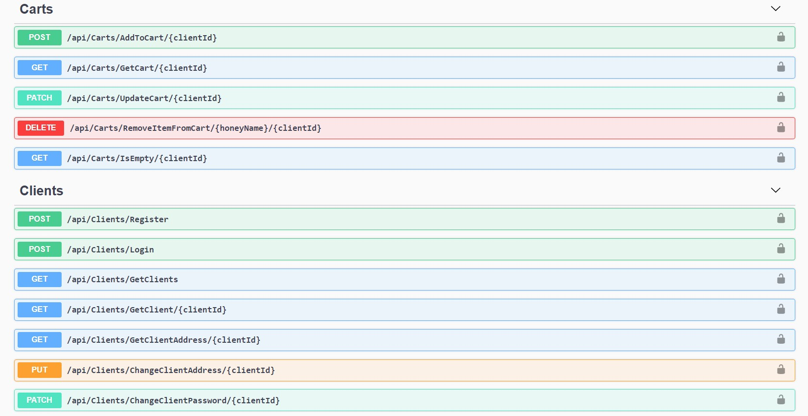
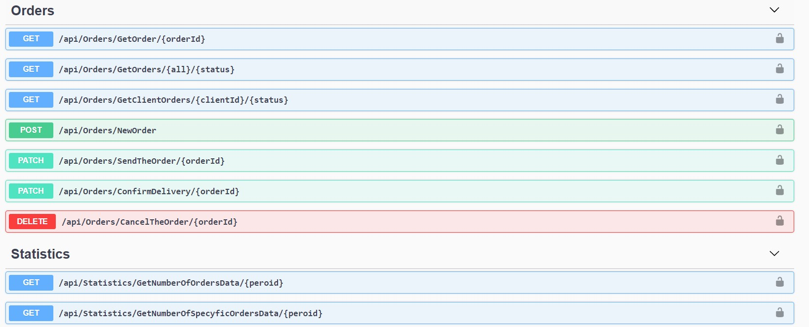
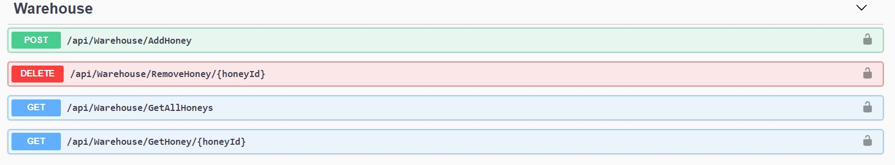

# HoneyStore - API
This repository conatins API for [HoneyStore](https://github.com/TomWia9/HoneyStore) - Web application for honeys shopping.

## Description
This project is an **ASP.NET Core 3.1** implemented Web API for communication with [HoneyStore](https://github.com/TomWia9/HoneyStore) - Angular 9 application.

**HoneyStore - API** enables communication with the [frontend](https://github.com/TomWia9/HoneyStore) application consisting of sending and receiving data regarding orders, warehouse staff, statistics etc.

It uses **Entity Framework Core** to communicate with a **Sql** database, which contains required data tables like:
* Clients - where informations about clients and their login data are stored 
* Addresses - where client addresses are stored 
* HoneysInTheWarehouse -  where are stored informations about honeys like pirce, amount etc.
* Orders - where informations about ordered honeys are stored  

This API uses also basic authentication provided by **JwtBearer** and API documentation provided by **Swagger**.

# Screenshots of API requests from Swagger

  
Click to expand!

  
  
  
  

  

## Installation
Make sure you have the **.NET Core 3.1 SDK** installed on your machine. Then do:  
>`git clone https://github.com/TomWia9/iWorker-ASP.NET-CORE.git`  
`cd iWorker-ASP.NET-CORE\IWorker\`  
`dotnet run`

## Configuration
This will need to be perfored before running the application for the first time
1. You have to change ConnectionString in **appsettings.json** for ConnectionString that allow you to connect with database in your computer.
2. Issue the Entity Framework command to update the database  
`dotnet ef database update`
 
## License
[MIT](https://choosealicense.com/licenses/mit/)
